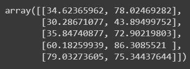

# Implementation-of-Logistic-Regression-Using-Gradient-Descent

## AIM:
To write a program to implement the the Logistic Regression Using Gradient Descent.

## Equipments Required:
1. Hardware – PCs
2. Anaconda – Python 3.7 Installation / Jupyter notebook

## Algorithm
1. Import the necessary libraries: numpy, matplotlib.pyplot, and scipy.optimize.
2. Load the data from the file "ex2data1.txt" using numpy.loadtxt and split it into input features X and target variable Y.
3. Visualize the data by creating a scatter plot with two classes: "Admitted" and "Not admitted".
4. Define the sigmoid function that maps any real number to the range [0, 1].
5. Plot the sigmoid function using a range of values.
6. Define the cost function for logistic regression and its gradient.
7. Add a column of ones to the input features to account for the intercept term.
8. Initialize the parameters theta with zeros.
9. Compute the initial cost and gradient using the initial parameters.
10. Print the initial cost and gradient.
11. Use the scipy.optimize.minimize function to minimize the cost function and find the optimal parameters.
12. Print the final cost and optimized parameters.
13. Define a function to plot the decision boundary by creating a grid of points and computing the corresponding predicted class.
14. Plot the decision boundary along with the data points.
15. Calculate the probability of admission for a student with exam scores [45, 85].
16. Define a function to predict the class labels based on the learned parameters.


## Program:

```
/*
Program to implement the the Logistic Regression Using Gradient Descent.
Developed by: Aswathi S
RegisterNumber:  212220040020
*/

import numpy as np
import matplotlib.pyplot as plt
from scipy import optimize

data = np.loadtxt("/content/ex2data1.txt",delimiter=",")

X = data[:, [0,1]]
Y = data[:,2]

X[:5]

Y[:5]

plt.figure()
plt.scatter(X[y == 1][:, 0], X[y == 1][:, 1], label="Admitted")
plt.scatter(X[y == 0][:, 0], X[y == 0][:, 1], label="Not admitted")
plt.xlabel("Exam 1 score")
plt.ylabel("Exam 2 score")
plt.legend()
plt.show()

def sigmoid(z):
    return 1 / (1 + np.exp(-z))

plt.plot()
X_plot = np.linspace(-10, 10, 100)
plt.plot(X_plot, sigmoid(X_plot))
plt.show()

def costFunction(theta, X, y):
    h = sigmoid(np.dot(X, theta))
    J = -(np.dot(y, np.log(h)) + np.dot(1 - y, np.log(1 - h))) / X.shape[0]
    grad = np.dot(X.T, h - y) / X.shape[0]
    return J, grad

X_train = np.hstack((np.ones((X.shape[0], 1)), X))
theta = np.array([0, 0, 0])
J, grad = costFunction(theta, X_train, y)
print(J)  
print(grad)  

X_train = np.hstack((np.ones((X.shape[0], 1)), X))
theta = np.array([-24, 0.2, 0.2])
J, grad = costFunction(theta, X_train, y)
print(J) 
print(grad)  

def cost(theta, X, y):
    h = sigmoid(np.dot(X, theta))
    J = - (np.dot(y, np.log(h)) + np.dot(1 - y, np.log(1 - h))) / X.shape[0]
    return J


def gradient(theta, X, y):
    h = sigmoid(np.dot(X, theta))
    grad = np.dot(X.T, h - y) / X.shape[0]
    return grad


X_train = np.hstack((np.ones((X.shape[0], 1)), X))
theta = np.array([0, 0, 0])
res = optimize.minimize(fun=cost, x0=theta, args=(X_train, y),
                        method='Newton-CG', jac=gradient)
print(res.fun) 
print(res.x)  


def plotDecisionBoundary(theta, X, y):
    x_min, x_max = X[:, 0].min() - 1, X[:, 0].max() + 1
    y_min, y_max = X[:, 1].min() - 1, X[:, 1].max() + 1
    xx, yy = np.meshgrid(np.arange(x_min, x_max, 0.1),
                         np.arange(y_min, y_max, 0.1))
    X_plot = np.c_[xx.ravel(), yy.ravel()]
    X_plot = np.hstack((np.ones((X_plot.shape[0], 1)), X_plot))
    y_plot = np.dot(X_plot, theta).reshape(xx.shape)
    
    plt.figure()
    plt.scatter(X[y == 1][:, 0], X[y == 1][:, 1], label="Admitted")
    plt.scatter(X[y == 0][:, 0], X[y == 0][:, 1], label="Not admitted")
    plt.contour(xx, yy, y_plot, levels=[0])
    plt.xlabel("Exam 1 score")
    plt.ylabel("Exam 2 score")
    plt.legend()
    plt.show()


plotDecisionBoundary(res.x, X, y)


prob = sigmoid(np.dot(np.array([1, 45, 85]), res.x))
print(prob)  


def predict(theta, X):
    X_train = np.hstack((np.ones((X.shape[0], 1)), X))
    prob = sigmoid(np.dot(X_train, theta))
    return (prob >= 0.5).astype(int)


np.mean(predict(res.x, X) == y)
```

## Output:



## Result:
Thus the program to implement the the Logistic Regression Using Gradient Descent is written and verified using python programming.